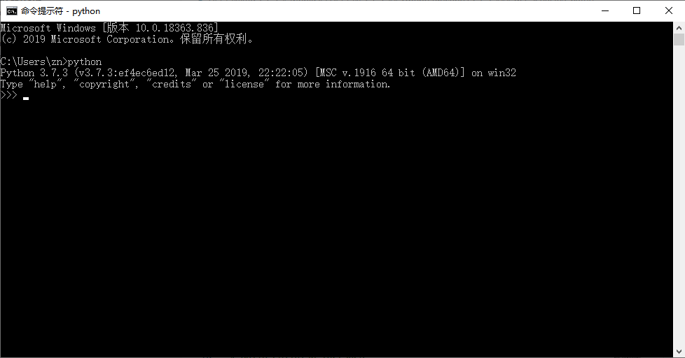

# MobiusPi API Manual

- [MobiusPi API Manual](#mobiuspi-api-manual)
  - [Overview](#overview)
  - [Installation SDK](#installation-sdk)
  - [Python requirements](#python-requirements)
  - [1. Basic](#1-basic)
    - [Getting started](#getting-started)
    - [Instructions for use](#instructions-for-use)
    - [Method description](#method-description)
      - [reboot()](#reboot)
        - [Description](#description)
        - [Request parameters](#request-parameters)
        - [Returns](#returns)
  - [2. Cellular](#2-cellular)
    - [Getting started](#getting-started-1)
    - [Instructions for use](#instructions-for-use-1)
    - [Method description](#method-description-1)
      - [get\_modem()](#get_modem)
        - [Description](#description-1)
        - [Request parameters](#request-parameters-1)
        - [Returns](#returns-1)
        - [Exception](#exception)
      - [get\_network()](#get_network)
        - [Description](#description-2)
        - [Request parameters](#request-parameters-2)
        - [Returns](#returns-2)
        - [Exception](#exception-1)
  - [3. Config](#3-config)
    - [Getting started](#getting-started-2)
    - [Instructions for use](#instructions-for-use-2)
    - [Method description](#method-description-2)
      - [get\_app\_path()](#get_app_path)
        - [Description](#description-3)
        - [Request parameters](#request-parameters-3)
        - [Returns](#returns-3)
      - [get\_app\_log\_path()](#get_app_log_path)
        - [Description](#description-4)
        - [Request parameters](#request-parameters-4)
        - [Returns](#returns-4)
      - [get\_app\_cfg\_path()](#get_app_cfg_path)
        - [Description](#description-5)
        - [Request parameters](#request-parameters-5)
        - [Returns](#returns-5)
      - [get\_app\_cfg\_file()](#get_app_cfg_file)
        - [Description](#description-6)
        - [Request parameters](#request-parameters-6)
        - [Returns](#returns-6)
      - [get\_default\_app\_cfg\_file()](#get_default_app_cfg_file)
        - [Description](#description-7)
        - [Request parameters](#request-parameters-7)
        - [Returns](#returns-7)
      - [get\_app\_db\_base\_path()](#get_app_db_base_path)
        - [Description](#description-8)
        - [Request parameters](#request-parameters-8)
        - [Returns](#returns-8)
      - [get\_app\_db\_path()](#get_app_db_path)
        - [Description](#description-9)
        - [Request parameters](#request-parameters-9)
        - [Returns](#returns-9)
  - [4. GPS](#4-gps)
    - [Getting started](#getting-started-3)
    - [Instructions for use](#instructions-for-use-3)
    - [Method description](#method-description-3)
      - [get\_position\_status()](#get_position_status)
        - [Description](#description-10)
        - [Request parameters](#request-parameters-10)
        - [Returns](#returns-10)
        - [Exception](#exception-2)
  - [5. I/O](#5-io)
    - [Getting started](#getting-started-4)
    - [Instructions for use](#instructions-for-use-4)
    - [Method description](#method-description-4)
      - [get\_io\_list()](#get_io_list)
        - [Description](#description-11)
        - [Request parameters](#request-parameters-11)
        - [Returns](#returns-11)
        - [Exception](#exception-3)
      - [get\_io\_info(io\_name)](#get_io_infoio_name)
        - [Description](#description-12)
        - [Request parameters](#request-parameters-12)
        - [Returns](#returns-12)
        - [Exception](#exception-4)
      - [get\_all\_io\_info()](#get_all_io_info)
        - [Description](#description-13)
        - [Request parameters](#request-parameters-13)
        - [Returns](#returns-13)
        - [Exception](#exception-5)
      - [setup\_digital\_io(io\_name, mode)](#setup_digital_ioio_name-mode)
        - [Description](#description-14)
        - [Request parameters](#request-parameters-14)
        - [Returns](#returns-14)
        - [Exception](#exception-6)
      - [setup\_analog\_io(io\_name, mode)](#setup_analog_ioio_name-mode)
        - [Description](#description-15)
        - [Request parameters](#request-parameters-15)
        - [Returns](#returns-15)
        - [Exception](#exception-7)
      - [read\_io(io\_name)](#read_ioio_name)
        - [Description](#description-16)
        - [Request parameters](#request-parameters-16)
        - [Returns](#returns-16)
        - [Exception](#exception-8)
      - [write\_io(io\_name)](#write_ioio_name)
        - [Description](#description-17)
        - [Request parameters](#request-parameters-17)
        - [Returns](#returns-17)
        - [Exception](#exception-9)
  - [6. Serial](#6-serial)
    - [Getting started](#getting-started-5)
    - [Instructions for use](#instructions-for-use-5)
    - [Method description](#method-description-5)
      - [get\_serial232\_path()](#get_serial232_path)
        - [Description](#description-18)
        - [Request parameters](#request-parameters-18)
        - [Returns](#returns-18)
        - [Exception](#exception-10)
      - [get\_serial485\_path()](#get_serial485_path)
        - [Description](#description-19)
        - [Request parameters](#request-parameters-19)
        - [Returns](#returns-19)
        - [Exception](#exception-11)
  - [7. SystemInfo](#7-systeminfo)
    - [Getting started](#getting-started-6)
    - [Instructions for use](#instructions-for-use-6)
    - [Method description](#method-description-6)
      - [get\_system\_info()](#get_system_info)
        - [Description](#description-20)
        - [Request parameters](#request-parameters-20)
        - [Returns](#returns-20)
        - [Exception](#exception-12)

<a id="overview"> </a>

## Overview

MobiusPi is the secondary development platform for the InGateway series product. This document explains how to call the APIs of the `mobiuspi_lib` library. This library is used to retrieve MobiusPi's runtime status and call MobiusPi's physical interfaces.

<a id="installation"> </a>

## Installation SDK

InHand Networks provides the software development kit (SDK) that includes the `mobiuspi_lib` library. Please contact our customer services if you want to obtain MobiusPi's SDK and its feature information. For more information about how to install and upgrade the SDK, see [IG902 Updated Software Versions.](http://manual.ig.inhandnetworks.com/en/latest/IG902-Quick-Start-Manual.html#update-the-software)

<a id="python-requirements"> </a>

## Python requirements

The MobiusPi Python SDK is applicable to Python 3.7 and 3.8. If you use other Python versions, code execution may be abnormal. You can access the command prompt or start python IDE and run the `python` command to view your Python version. The content of this document is based on Python 3.7 and 3.8.



<a id="basic"> </a>

## 1. Basic

<a id="getting-started1"> </a>

### Getting started

The following example shows how to restart MobiusPi.

```python
# Import the Basic class
from mobiuspi_lib.basic import Basic

# Create a basic instance
basic = Basic()

# Restart MobiusPi
print("will reboot ...")
r = basic.reboot()
print("reboot : %s" % r)
```

<a id="basic-use"> </a>

### Instructions for use

You can use the Basic class as an instance, within a class or by subclassing. The general usage flow is as follows:

* Create a `basic` instance
* Use `reboot()` to restart MobiusPi

<a id="option-functions1"> </a>

### Method description

#### reboot()

##### Description

Use this method to restart MobiusPi.

##### Request parameters

None

##### Returns

- Return type
  
  str

- Return value
  
  ```python
  ok
  ```

- Return value description
  
  - `ok`: MobiusPi is restarted successfully.
  - `failed`: MobiusPi cannot be restarted.

<a id="cellularapi"> </a>

## 2. Cellular

<a id="getting-started2"> </a>

### Getting started

The following example shows how to retrieve the MobiusPi cellular information:

```python
# Import the Cellular class
from mobiuspi_lib.cellular import Cellular

# Create a cellular instance
cellular = Cellular()

# Retrieve modem information
modem = cellular.get_modem()
print("get modem: %s" % modem)
```

Output result of the example:

```python
get modem: {
    "active_sim": "SIM 1",
    "imei_code": "811622048741556",
    "imsi_code": "411220441893359",
    "iccid_code": "84463317227780999882",
    "phone_number": "+8611162203133",
    "signal_level": 0,
    "dbm": 113,
    "rerp": 0,
    "rerq": 0,
    "register_status": 0,
    "operator": "CHN-CT",
    "apns": "",
    "network_type": "4G",
    "lac": "BB00",
    "cell_id": "DD788B81"
}
```

<a id="cellular-use"> </a>

### Instructions for use

You can use the Cellular class as an instance, within a class or by subclassing. The general usage flow is as follows:

* Create a `cellular` instance
* Use `get_modem()` to retrieve the modem status
* Use `get_network()` to retrieve network connection information

<a id="option-functions2"> </a>

### Method description

<a id="get-modem"> </a>

#### get_modem()

##### Description

Use this method to retrieve the modem status.

##### Request parameters

None

##### Returns

- Return type
  
  dict

- Return value
  
  ```python
  {
      "active_sim": "SIM 1",
      "imei_code": "811622048741556",
      "imsi_code": "411220441893359",
      "iccid_code": "84463317227780999882",
      "phone_number": "+8611162203133",
      "signal_level": 0,
      "dbm": 113,
      "rerp": 0,
      "rerq": 0,
      "register_status": 0,
      "operator": "CHN-CT",
      "apns": "",
      "network_type": "4G",
      "lac": "BB00",
      "cell_id": "DD788B81"
  }
  ```

- Return value description
  
  - `active_sim`(string): current SIM card.
  - `imei_code`(string): international mobile equipment identity (IMEI). A `null string` is returned if the IMEI cannot be retrieved.
  - `imsi_code`(string): international mobile subscriber identity (IMSI). A `null string` is returned if the IMSI cannot be retrieved.
  - `iccid_code`(string): integrated circuit card identifier (ICCID). A `null string` is returned if the ICCID cannot be retrieved.
  - `phone_number`(string): phone number. A `null string` is returned if the phone number cannot be retrieved.
  - `signal_level`(int): signal value.
  - `dbm`(int): value, in the unit of dBm.
  - `rerp`(int): reference signal received power (RSRP), reserved.
  - `rerq`(int): reference signal received quality (RSRQ), reserved.
  - `register_status`(int): registration status.
    - `0`: Network registration is in progress.
    - `1`: Network registration is successful.
    - `5`: Network registration is successful, and the user is in the roaming state.
    - `6`: Network registration is not completed.
    - `7`: Unregistered.
  - `operator`(string): Operator. A `null string` is returned if the operator name cannot be retrieved.
  - `apns`(string): access point name (APN), reserved.
  - `network_type`(string): network type. A `null string` is returned if the network type cannot be retrieved.
  - `lac`(string): location area code (LAC). A `null string` is returned if the LAC cannot be retrieved.
  - `cell_id`(string): cell ID. A `null string` is returned if the cell ID cannot be retrieved.

##### Exception

When the request times out, the following error message is returned:

```python
KeyError: 'Connection Timeout'
```

<a id="get-network"> </a>

#### get_network()

##### Description

Use this method to retrieve the network connection information.

##### Request parameters

None

##### Returns

- Return type
  
  list

- Return value
  
  ```python
  [
  {
      'status': 0,
      'ip_addr': '0.0.0.0',
      'netmask': '0.0.0.0',
      'gateway': '0.0.0.0',
      'dns': '0.0.0.0',
      'mtu': 1200,
      'connect_time': 0
  }]
  ```

- Return value description
  
  - `status`(int): network status
    - `0`: network not connected
    - `1`: network connected
  - `ip_addr`(string): IP address
  - `netmask`(string): subnet mask
  - `gateway`(string): gateway
  - `dns`(string): domain name server (DNS)
  - `mtu`(int): maximum transmission unit (MTU)
  - `connect_time`(int): connection time, in the unit of seconds

##### Exception

When the request times out, the following error message is returned:

```python
KeyError: 'Connection Timeout'
```

<a id="config"> </a>

## 3. Config

<a id="getting-started3"> </a>

### Getting started

The following example shows how to retrieve the app path and its configuration file path:

```python
# Import the Config class
from mobiuspi_lib.config import Config

# Create a config instance, which corresponds to the app name HelloWorld. If no app exists in the /var/user/app/ path when the config class is instantiated, the error message "FileExistsError: Invalid app_name, do not find app HelloWorld" is returned.
config = Config(app_name="HelloWorld")

# Retrieve the app path
get_app_path = config.get_app_path()
print("get_app_path: %s" % get_app_path)

# Retrieve the path of the app configuration folder
get_app_cfg_path = config.get_app_cfg_path()
print("get_app_cfg_path: %s" % get_app_cfg_path)
```

Output result of the example:

```python
get_app_path: /var/user/app/HelloWorld
get_app_cfg_path: /var/user/cfg/HelloWorld
```

<a id="config-use"> </a>

### Instructions for use

You can use the Config class as an instance, within a class or by subclassing. The general usage flow is as follows:

* Create a `config` instance
* Use `get_app_path()` to retrieve the app path
* Use `get_app_cfg_path()` to retrieve the path of the app configuration folder

<a id="option-functions3"> </a>

### Method description

<a id="get-app-path"> </a>

#### get_app_path()

##### Description

Use this method to retrieve the app path.

##### Request parameters

None

##### Returns

- Return type
  
  str

- Return value
  
  ```python
  /var/user/app/HelloWorld
  ```

<a id="get-app-log-path"> </a>

#### get_app_log_path()

##### Description

Use this method to retrieve the app log file path.

##### Request parameters

None

##### Returns

- Return type
  
  str

- Return value
  
  ```python
  /var/user/log/HelloWorld
  ```

<a id="get-app-cfg-path"> </a>

#### get_app_cfg_path()

##### Description

Use this method to retrieve the path of the app configuration folder.

##### Request parameters

None

##### Returns

- Return type
  
  str

- Return value
  
  ```python
  /var/user/cfg/HelloWorld
  ```

<a id="get-app-cfg-file"> </a>

#### get_app_cfg_file()

##### Description

Use this method to retrieve the path of the current app configuration file.

##### Request parameters

None

##### Returns

- Return type
  
  str

- Return value
  
  ```python
  /var/user/app/HelloWorld/config.yaml
  ```

<a id="get-default-app-cfg-file"> </a>

#### get_default_app_cfg_file()

##### Description

Use this method to retrieve the path of the default app configuration file.

##### Request parameters

None

##### Returns

- Return type
  
  str

- Return value
  
  ```python
  /var/user/app/HelloWorld/config.yaml
  ```

<a id="get-app-db-base-path"> </a>

#### get_app_db_base_path()

##### Description

Use this method to retrieve the home path of the database.

##### Request parameters

None

##### Returns

- Return type
  
  str

- Return value
  
  ```python
  /var/user/data/dbhome
  ```

<a id="get-app-db-path"> </a>

#### get_app_db_path()

##### Description

Use this method to retrieve the app database path.

##### Request parameters

None

##### Returns

- Return type
  
  str

- Return value
  
  ```python
  /var/user/data/dbhome/HelloWorld
  ```

<a id="gps"> </a>

## 4. GPS

<a id="getting-started4"> </a>

### Getting started

The following example shows how to retrieve the GPS information:

```python
# Import the GPS class
from mobiuspi_lib.gps import GPS

# Create a gps instance
gps = GPS()

# Retrieve GPS information
position_status = gps.get_position_status()
print("position_status: ")
print(position_status)
```

Output result of the example:

```python
position_status: {
    'gps_enable': 1,
    'gps_time': '2020-06-10  09:31:25',
    'latitude': "30° 35.276870' N",
    'longitude': "104° 3.251330' E",
    'speed': '0.3500 Knots (1knot = 1.852km/h)'
}
```

<a id="gps-use"> </a>

### Instructions for use

You can use the GPS class as an instance, within a class or by subclassing. The general usage flow is as follows:

* Create a `gps` instance
* Use `get_position_status()` to retrieve GPS information

<a id="option-functions4"> </a>

### Method description

<a id="get-position-status"> </a>

#### get_position_status()

##### Description

Use this method to retrieve MobiusPi's GPS information.

##### Request parameters

None

##### Returns

- Return type
  
  dict

- Return value
  
  ```python
  {
    'gps_enable': 1,
    'gps_time': '2020-06-10  09:31:25',
    'latitude': "30° 35.276870' N",
    'longitude': "104° 3.251330' E",
    'speed': '0.3500 Knots (1knot = 1.852km/h)'
  }
  ```

- Return value description
  
  - `gps_enable`: specifies whether GPS is enabled.
    - `0`: GPS is not enabled.
    - `1`: GPS is enabled.
  - `gps_time`: positioning time.
  - `latitude`: latitude. A `null string` is returned if the latitude cannot be retrieved.
  - `longitude`: longitude. A `null string` is returned if the longitude cannot be retrieved.
  - `speed`: speed.

##### Exception

When the request times out, the following error message is returned:

```python
KeyError: 'Connection Timeout'
```

<a id="io"> </a>

## 5. I/O

<a id="getting-started5"> </a>

### Getting started

The following example shows how to retrieve the I/O name, specify the input I/O mode, read the I/O status, and modify the output I/O:

```python
# Import the I/O class and variables used by I/O-related methods
from mobiuspi_lib.io import IO, DIGITAL_DRY_CONTACT_MODE, DIGITAL_WET_CONTACT_MODE, DRY_CONTACT_HIGH_VALUE, SHUT_DOWN_MODE, DRY_CONTACT_LOW_VALUE, ANALOG_LOW_A_MODE, ANALOG_HIGH_A_MODE, ANALOG_LOW_V_MODE, and ANALOG_HIGH_V_MODE

# Create an io instance
io = IO()

# Retrieve all I/O names
io_list = io.get_io_list()
print("io_list: %s " % io_list)

# Set the digital input I/O mode
sdi = io.setup_digital_io(io_name="di0", mode=DIGITAL_DRY_CONTACT_MODE)
print("sdi: %s" % sdi)

# Read the I/O status 
ri0 = io.read_io(io_name="di0")
print("ri0: %s" % ri0)

# Modify the output I/O
io.write_io(io_name="do0", value=DRY_CONTACT_HIGH_VALUE)
ro0 = io.read_io(io_name="do0")
print("ro0: %s" % ro0)
```

Output result of the example:

```python
io_list: ['di0', 'di1', 'di2', 'di3', 'do0', 'do1', 'ai0', 'ai1'] 
sdi: {'index': 0, 'name': 'di0', 'type': 'digital input', 'mode': 'drycontact'}
ri0: LOW
ro0: ON
```

<font color=#FF0000>Note: Only devices with model IG902 and IO support AI support this API. For other models, please refer to the [I/O Module](http://manual.ig.inhandnetworks.com/en/latest/IG502-Quick-Start-Manual.html#i-o-module) for information on obtaining IO status.</font>  

<a id="io-use"> </a>

### Instructions for use

You can use the IO class as an instance, within a class or by subclassing. The general usage flow is as follows:

* Create an `io` instance
* Use `get_io_list()` to retrieve all I/O names
* Use `setup_digital_io()` to set the digital input I/O mode
* Use `setup_analog_io()` to set the analog input I/O mode
* Use `read_io(io_name="")` to retrieve the I/O status
* Use `write_io()` to modify the digital output I/O status

<a id="option-functions5"> </a>

### Method description

<a id="get-io-list"> </a>

#### get_io_list()

##### Description

Use this method to retrieve all I/O names.

##### Request parameters

None

##### Returns

- Return type
  
  list

- Return value
  
  ```python
  ['di0', 'di1', 'di2', 'di3', 'do0', 'do1', 'ai0', 'ai1']
  ```

- Return value description  
di0 to di3 specify digital inputs DIO to DI3. do0 and do1 specify digital outputs DO0 and DO1. ai0 and ai1 specify analog inputs AI0 and AI1.

##### Exception

When the request times out, the following error message is returned:

```python
KeyError: 'Connection Timeout'
```

<a id="get-io-info"> </a>

#### get_io_info(io_name)

##### Description

Use this method to retrieve the type and mode of a specific I/O.

##### Request parameters

- `io_name`: I/O name

##### Returns

- Return type
  
  dict

- Return value
  
  ```python
  {
    'index': 0,
    'name': 'di0',
    'type': 'digital input',
    'mode': 'drycontact'
  }
  ```

- Return value description
  
  - `index`: index
  - `name`: I/O name
  - `type`: I/O type
    - `digital input`: digital input
    - `digital output`: digital output
    - `analog input`: analog input
  - `mode`: I/O mode
    - Digital input I/O
      - `wetcontact`: wet contact
      - `drycontact`: dry contact
      - `shutdown`: shutdown
    - Digital output I/O
      - `connect`: connected
      - `break`: disconnected
    - Analog input I/O
      - `0_20mA`: 0 mA to 20 mA
      - `4_20mA`: 4 mA to 20 mA
      - `0_5V`: 0 V to 5 V
      - `0_10V`: 0 V to 10 V
      - `shutdown`: shutdown

##### Exception

- When io_name is set to an incorrect I/O name, such as `dd1`, the following error message is returned:
  
  ```python
  KeyError: 'Invalid io_name'
  ```

- When the request times out, the following error message is returned:
  
  ```python
  KeyError: 'Connection Timeout'
  ```

<a id="get-all-io-info"> </a>

#### get_all_io_info()

##### Description

Use this method to retrieve the types and modes of all I/Os.

##### Request parameters

None

##### Returns

- Return type
  
  list

- Return value
  
  ```python
  [{
      'index': 0,
      'name': 'di0',
      'type': 'digital input',
      'mode': 'drycontact'
  }, {
      'index': 1,
      'name': 'di1',
      'type': 'digital input',
      'mode': 'wetcontact'
  }, {
      'index': 2,
      'name': 'di2',
      'type': 'digital input',
      'mode': 'shutdown'
  }, {
      'index': 3,
      'name': 'di3',
      'type': 'digital input',
      'mode': 'drycontact'
  }, {
      'index': 0,
      'name': 'do0',
      'type': 'digital output',
      'mode': 'connect'
  }, {
      'index': 1,
      'name': 'do1',
      'type': 'digital output',
      'mode': 'break'
  }, {
      'index': 0,
      'name': 'ai0',
      'type': 'analog input',
      'mode': '4_20mA'
  }, {
      'index': 1,
      'name': 'ai1',
      'type': 'analog input',
      'mode': '0_5V'
  }]
  ```

- Return value description
  
  - `index`: index
  - `name`: I/O name
  - `type`: I/O type
    - `digital input`: digital input
    - `digital output`: digital output
    - `analog input`: analog input
  - `mode`: I/O mode
    - Digital input I/O
      - `wetcontact`: wet contact
      - `drycontac`t: dry contact
      - `shutdown`: shutdown
    - Digital output I/O
      - `connect`: connected
      - `break`: disconnected
    - Analog input I/O
      - `0_20mA`: 0 mA to 20 mA
      - `4_20mA`: 4 mA to 20 mA
      - `0_5V`: 0 V to 5 V
      - `0_10V`: 0 V to 10 V
      - `shutdown`: shutdown

##### Exception

When the request times out, the following error message is returned:

```python
KeyError: 'Connection Timeout'
```

<a id="setup-digital-io"> </a>

#### setup_digital_io(io_name, mode)

##### Description

Use this method to set the digital input I/O mode.

##### Request parameters

- `io_name`: I/O name <font color=#FF0000>(only digital input I/O is supported)</font>
- `mode`: digital input I/O mode
  - `DIGITAL_DRY_CONTACT_MODE`: dry contact mode
  - `DIGITAL_WET_CONTACT_MODE`: wet contact mode
  - `SHUT_DOWN_MODE`: shutdown

##### Returns

- Return type
  
  dict

- Return value
  
  ```python
  {
    'index': 0,
    'name': 'di0',
    'type': 'digital input',
    'mode': 'drycontact'
  }
  ```

- Return value description
  
  - `index`: index
  - `name`: I/O name
  - `type`: I/O type
    - `digital input`: digital input
  - `mode`: I/O mode
    - `wetcontact`: wet contact
    - `drycontact`: dry contact
    - `shutdown`: shutdown

##### Exception

- When io_name is set to an incorrect I/O name, such as `dd1`, the following error message is returned:
  
  ```python
  KeyError: 'Invalid io_name'
  ```

- When the name of a digital output I/O or analog input I/O is entered, such as `do0`, the following error message is returned:
  
  ```python
  KeyError: 'Parameter Conflict'
  ```

- When an incorrect mode is entered, such as `1234`, the following error message is returned:
  
  ```python
  KeyError: 'Invalid mode'
  ```

- When the request times out, the following error message is returned:
  
  ```python
  KeyError: 'Connection Timeout'
  ```

- When MobiusPi is busy, the following error message is returned:
  
  ```python
  KeyError: 'Device Busy'
  ```

<a id="setup-analog-io"> </a>

#### setup_analog_io(io_name, mode)

##### Description

Use this method to set the analog input I/O mode.

##### Request parameters

- `io_name`: I/O name <font color=#FF0000>(only analog input I/O is supported)</font>
- `mode`: analog input I/O mode
  - `ANALOG_LOW_A_MODE`: 0-20 mA mode
  - `ANALOG_HIGH_A_MOD`E: 4-20 mA mode
  - `ANALOG_LOW_V_MODE`: 0-5 V mode
  - `ANALOG_HIGH_V_MODE`: 0-10 V mode
  - `SHUT_DOWN_MODE`: shutdown

##### Returns

- Return type
  
  dict

- Return value
  
  ```python
  {
    'index': 0,
    'name': 'ai0',
    'type': 'analog input',
    'mode': '4_20mA'
  }
  ```

- Return value description
  
  - `index`: index
  - `name`: I/O name
  - `type`: I/O type
    - `analog input`: analog input
  - `mode`: I/O mode
    - `0_20mA`: 0 mA to 20 mA
    - `4_20mA`: 4 mA to 20 mA
    - `0_5V`: 0 V to 5 V
    - `0_10`V: 0 V to 10 V
    - `shutdown`: shutdown

##### Exception

- When io_name is set to an incorrect I/O name, such as `dd1`, the following error message is returned:
  
  ```python
  KeyError: 'Invalid io_name'
  ```

- When the name of a digital input or output I/O is entered, such as `do0`, the following error message is returned:
  
  ```python
  KeyError: 'Parameter Conflict'
  ```

- When an incorrect mode is entered, such as `1234`, the following error message is returned:
  
  ```python
  KeyError: 'Invalid mode'
  ```

- When the request times out, the following error message is returned:
  
  ```python
  KeyError: 'Connection Timeout'
  ```

- When MobiusPi is busy, the following error message is returned:
  
  ```python
  KeyError: 'Device Busy'
  ```

<a id="read-io"> </a>

#### read_io(io_name)

##### Description

Use this method to read the I/O status.

##### Request parameters

- `io_name`: I/O name

##### Returns

- Return type
  
  str

- Return value
  
  ```python
  LOW
  ```

- Return value description
  
  - `ON`
    - `ON` is returned when the digital input I/O mode is wet contact and the input voltage ranges from 10 V to 30 V.
    - `ON` is returned when the digital output I/O is connected.
  - `OFF`
    - `OFF` is returned when the digital input I/O mode is wet contact and the input voltage ranges from 0 V to 3 V.
    - `OFF` is returned when the digital output I/O is disconnected.
  - `LOW`: `LOW` is returned when the digital input I/O mode is dry contact and disconnected.
  - `HIGH`: `HIGH` is returned when the digital input I/O mode is dry contact and connected.
  - Current or voltage of analog input

##### Exception

- When io_name is set to an incorrect I/O name, such as `dd1`, the following error message is returned:
  
  ```python
  KeyError: 'Invalid io_name'
  ```

- When the request times out, the following error message is returned:
  
  ```python
  KeyError: 'Connection Timeout'
  ```

<a id="write-io"> </a>

#### write_io(io_name)

##### Description

Use this method to modify the digital output I/O status.

##### Request parameters

- `io_name`: name of a digital output I/O.
- `value`: value of the digital output I/O.
  - `DRY_CONTACT_LOW_VALUE`: Set the digital output I/O to the disconnected state.
  - `DRY_CONTACT_HIGH_VALUE`: Set the digital output I/O to the connected state.

##### Returns

- Return type
  
  str

- Return value
  
  ```python
  TRUE
  ```

- Return value description
  
  - TRUE: Settings are successfully delivered

##### Exception

- When io_name is set to an incorrect I/O name, such as `dd1`, the following error message is returned:
  
  ```python
  KeyError: 'Invalid io_name'
  ```

- When the name of a digital input I/O or analog input I/O is entered, such as `do0`, the following error message is returned:
  
  ```python
  KeyError: 'Invalid Parameter'
  ```

- When an incorrect value is entered, such as `1234`, the following error message is returned:
  
  ```python
  KeyError: 'Invalid value'
  ```

- When the request times out, the following error message is returned:
  
  ```python
  KeyError: 'Connection Timeout'
  ```

- When MobiusPi is busy, the following error message is returned:
  
  ```python
  KeyError: 'Device Busy'
  ```

<a id="serial"> </a>

## 6. Serial

<a id="getting-started6"> </a>

### Getting started

The following example shows how to retrieve the 232 or 485 serial port path:

```python
# Import the Serial class
from mobiuspi_lib.serial import Serial

# Create a Serial instance  
serial = Serial()

# Retrieve the 232 serial port path
path_232 = serial.get_serial232_path()
print("232 path: %s" % path_232)

# Retrieve the 485 serial port path
path_485 = serial.get_serial485_path()
print("485 path: %s" % path_485)
```

Output result of the example:

```python
232 path: /dev/ttyO1
485 path: /dev/ttyO3
```

<a id="serial-use"> </a>

### Instructions for use

You can instantiate the `Serial` class or its subclass. Procedure:

* Create an `serial` instance
* Use `get_serial232_path()` to retrieve the 232 serial port path.
* Use `get_serial485_path()` to retrieve the 485 serial port path.

<a id="option-functions6"> </a>

### Method description

<a id="get-serial232-path"> </a>

#### get_serial232_path()

##### Description

Use this method to retrieve the 232 serial port path.

##### Request parameters

None

##### Returns

- Return type
  
  str

- Return value
  
  ```python
  /dev/ttyO1
  ```

- Return value description
  
  - `/dev/ttyO5`: This value is returned when IG501 is used.
  - `/dev/ttyO1`: This value is returned when IG902 is used.

##### Exception

When the request times out, the following error message is returned:

```python
KeyError: 'Connection Timeout'
```

<a id="get-serial485-path"> </a>

#### get_serial485_path()

##### Description

Use this method to retrieve the 485 serial port path.

##### Request parameters

None

##### Returns

- Return type
  
  str

- Return value
  
  ```python
  /dev/ttyO3
  ```

- Return structure
  
  - `/dev/ttyO1`: This value is returned when IG501 is used.
  - `/dev/ttyO3`: This value is returned when IG902 is used.

##### Exception

When the request times out, the following error message is returned:

```python
KeyError: 'Connection Timeout'
```

<a id="systeminfo"> </a>

## 7. SystemInfo

<a id="getting-started7"> </a>

### Getting started

The following example shows how to retrieve the MobiusPi system information:

```python
# Import the SystemInfo class
from mobiuspi_lib.systeminfo import SystemInfo

# Create a sysinfo instance
sysinfo = SystemInfo()

# Retrieve the MobiusPi system information
get_system_info = sysinfo.get_system_info()
print("get system info: %s" % get_system_info)
```

Output result of the example:

```python
get system info: {
    'language': 'Chinese',
    'hostname': 'InGateway',
    'model_name': 'IG902H',
    'oem_name': 'inhand',
    'serial_number': 'GT902XXXXXXXXXX',
    'mac_addr1': '00:XX:XX:XX:XX:XX',
    'mac_addr2': '00:XX:XX:XX:XX:XX',
    'firmware_version': '2.0.0.r12644',
    'bootloader_version': '2017.01.r10517',
    'product_number': 'TH09-W-RE',
    'description': 'www.inhand.com.cn',
    'auto_save': 1,
    'encrypt_passwd': 1
}
```

<a id="systeminfo-use"> </a>

### Instructions for use

You can use the SystemInfo class as an instance, within a class or by subclassing. The general usage flow is as follows:

* Create an `sysinfo` instance
* Use `get_system_info()` to retrieve the MobiusPi system information

<a id="option-functions7"> </a>

### Method description

<a id="get-system-info"> </a>

#### get_system_info()

##### Description

Use this method to retrieve the MobiusPi system information.

##### Request parameters

None

##### Returns

- Return type
  
  dict

- Return value
  
  ```python
  {
    'language': 'Chinese',
    'hostname': 'InGateway',
    'model_name': 'IG902H',
    'oem_name': 'inhand',
    'serial_number': 'GT902XXXXXXXXXX',
    'mac_addr1': '00:XX:XX:XX:XX:XX',
    'mac_addr2': '00:XX:XX:XX:XX:XX',
    'firmware_version': '2.0.0.r12644',
    'bootloader_version': '2017.01.r10517',
    'product_number': 'TH09-W-RE',
    'description': 'www.inhand.com.cn',
    'auto_save': 1,
    'encrypt_passwd': 1
  }
  ```

- Return value description
  
  - `language`: language
    - `Chinese`: Chinese
    - `English`: English
  - `hostname`: MobiusPi name
  - `model_name`: MobiusPi model
  - `oem_name`: OEM name
  - `serial_number`: MobiusPi serial number
  - `mac_addr1`: MAC address 1 of MobiusPi
  - `mac_addr2`: MAC address 2 of MobiusPi
  - `firmware_version`: firmware version
  - `bootloader_version`: bootloader version
  - `product_number`: product number
  - `description`: product description
  - `auto_save`: whether to automatically save modified configurations
    - `0`: not automatically save modified configurations
    - `1`: automatically save modified configurations
  - `encrypt_passwd`: whether to encrypt plaintext passwords
    - `0`: not encrypt plaintext passwords
    - `1`: encrypt plaintext passwords

##### Exception

When the request times out, the following error message is returned:

```python
KeyError: 'Connection Timeout'
```