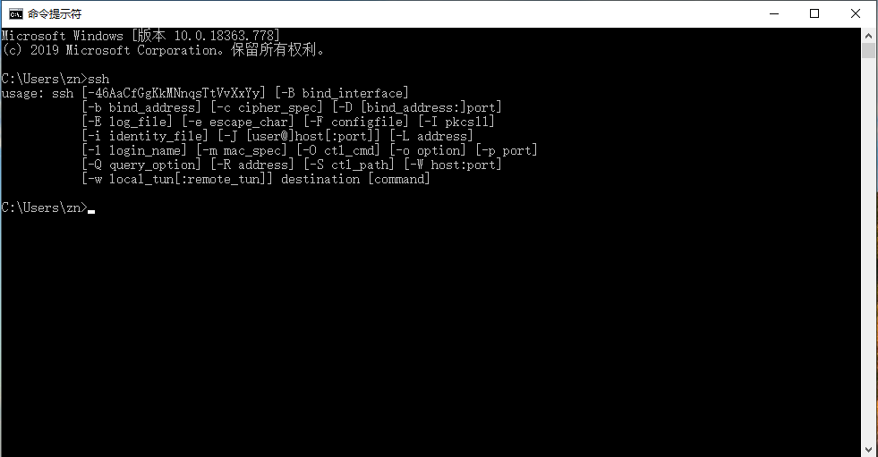
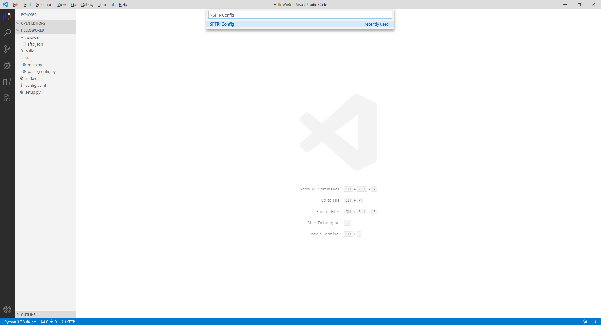
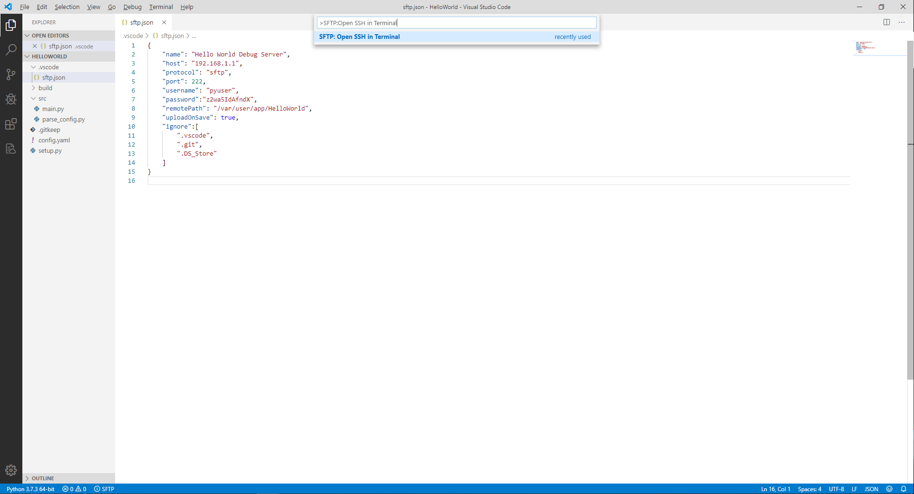
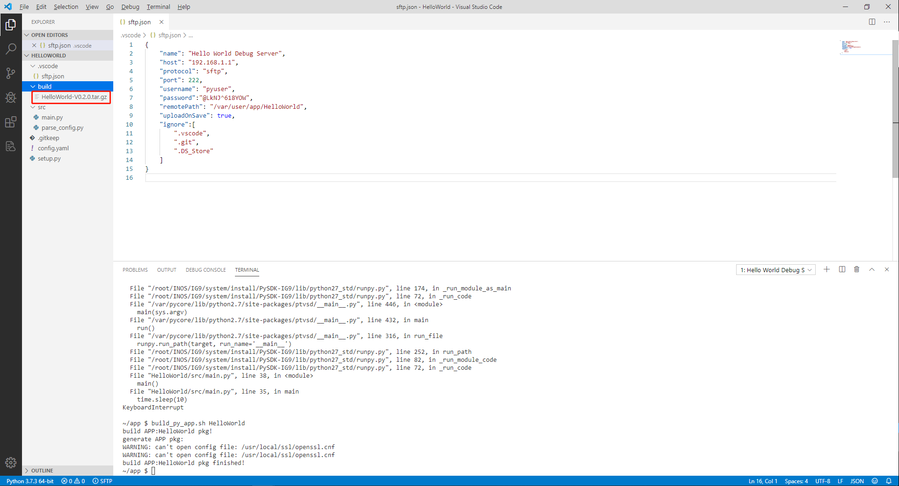
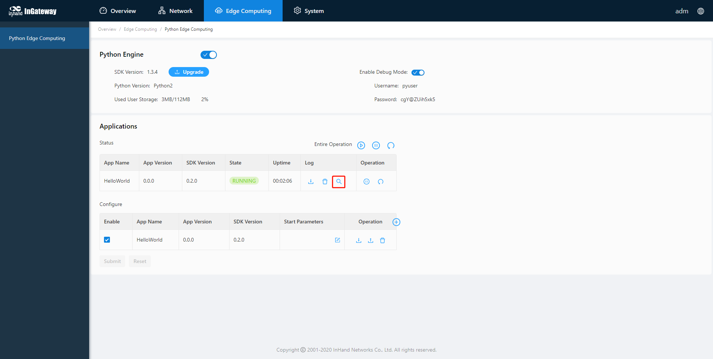
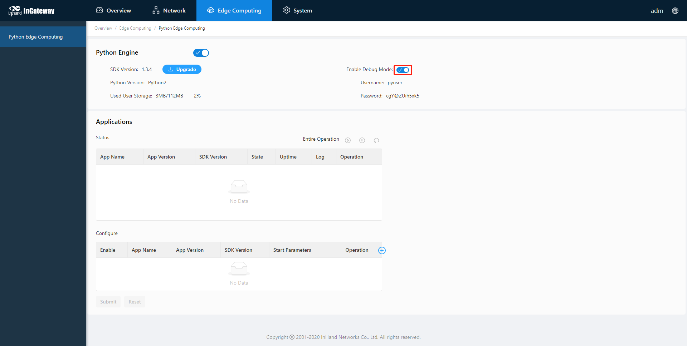

# **Quick Start for MobiusPi Python Development**

The InGateway series of Beijing InHand Networks Technology Co., Ltd. (InHand) consists of InGateway902 (referred to as **IG902** hereinafter) and InGateway501 (referred to as **IG501** hereinafter).  </br> MobiusPi is a secondary development platform for the InGateway series. This document describes how to perform Python-based secondary development on MobiusPi.

  - [1. Build a MobiusPi development environment](#build-a-mobiuspi-development-environment)
    - [1.1 Prepare the hardware and network environment](#prepare-the-hardware-and-network-environment)
      - [1.1.1 Connect the power supply and use a network cable to connect the platform to the PC](#connect-the-power-supply-and-use-a-network-cable-to-connect-the-platform-to-the-pc)
      - [1.1.2 Acess the MobiusPi](#configure-the-lan-parameters)
      - [1.1.3 Connect MobiusPi to the Internet](#configure-the-wan-parameters)
      - [1.1.4 Update the software version](#update-the-software-version)
      - [1.1.5 Enable the debugging mode for MobiusPi](#enable-the-debugging-mode-for-mobiuspi)
    - [1.2 Prepare the PC environment](#install-required-software-on-the-pc)
      - [1.2.1 Install the Python interpreter](#install-the-python-interpreter)
      - [1.2.2 Install Visual Studio Code](#install-visual-studio-code)
      - [1.2.3 Install OpenSSH](#install-openssh)
    - [1.3 Prepare the VS Code development environment](#prepare-the-vs-code-development-environment)
      - [1.3.1 Install the VS Code extension](#install-the-vs-code-extension)
      - [1.3.2 Configure the Python interpreter version](#configure-the-python-interpreter-version)
      - [1.3.3 Configure the project template](#configure-the-project-template)
        - [1.3.3.1 Apply the InHand standard project template](#apply-the-inhand-standard-project-template)
        - [1.3.3.2 Custom project template](#custom-project-template)
  - [2. Compile the MobiusPi App: Hello World](#compile-the-first-mobiuspi-app-hello-world)
    - [2.1 Use a template to create a project](#use-a-template-to-create-a-project)
    - [2.2 Encoding](#encoding)
    - [2.3 Debugging](#debugging)
      - [2.3.1 Create an SFTP connection](#create-an-sftp-connection)
      - [2.3.2 Debug the code](#debug-the-code)
    - [2.4 Build an App release package](#build-an-app-release-package)
    - [2.5 Deploy the App on the MobiusPi web page](#deploy-the-app-on-the-mobiuspi-web-page)
    - [2.6 View the App running status](#view-the-app-running-status)
    - [2.7 Update the App configuration file](#update-the-app-configuration-file)
    - [2.8 Annex](#annex)
      - [2.8.1 Install a third-party dependency library for the specified App](#install-a-third-party-dependency-library-for-the-specified-app)
      - [2.8.2 Install the third-party dependency library to SDK](#install-the-third-party-dependency-library-to-sdk)
      - [2.8.3 Enable automatic code completion](#enable-automatic-code-completion)
  - [FAQ](#faq)
    - [During SFTP connection building, it prompts "REMOTE HOST IDENTIFICATION HAS CHANGED and Host key verification failed"](#remote-host-id-update)
    - [When synchronizing the code to the remote server, it prompts "All configured authentication methods failed"](#the-configured-authentication-method-failed)
    - [How to call the serial port and network port of IG902 during development](#how-to-call-the-serial-port-and-network-port-of-ig900)
    - [When creating an SFTP connection with MobiusPi, it prompts "SSH error"](#ssh-error-when-setting-up-sftp-connection-with-mobiuspi)

<a id="build-a-mobiuspi-development-environment"> </a>  

## 1. Build a MobiusPi development environment

Before starting development, ensure that you get the following items ready:

- InGateway
  - InGateway501
    - Firmware version: V2.0.0.r12351 or later
    - SDK version: py2sdk-V1.3.4 or later
    - The network is connected and the debugging mode is enabled.
  - InGateway902
    - Firmware version: V2.0.0.r12537 or later
    - SDK version: py3sdk-V1.3.5 or later
    - The network is connected and the debugging mode is enabled.
- PC
  - Python 2.7.X/3.7.X interpreter
  - Visual Studio Code software
    - Python plug-in
    - Project Templates plug-in
    - SFTP plug-in
  - OpenSSH

If your MobiusPi and PC have met all the above items, skip this section. Otherwise, prepare a development environment as follows.

- [1.1 Prepare the hardware and network environment](#prepare-the-hardware-and-network-environment)
- [1.2 Prepare the PC environment](#install-required-software-on-the-pc)
- [1.3 Prepare the VS Code development environment](#prepare-the-vs-code-development-environment)

<a id="prepare-the-hardware-and-network-environment"> </a>  

### 1.1 Prepare the hardware and network environment

- [1.1.1 Connect the power supply and use a network cable to connect the platform to the PC](#connect-the-power-supply-and-use-a-network-cable-to-connect-the-platform-to-the-pc)
- [1.1.2 Acess the MobiusPi](#configure-the-lan-parameters)
- [1.1.3 Connect MobiusPi to the Internet](#configure-the-wan-parameters)
- [1.1.4 Update the software version](#update-the-software-version)
- [1.1.5 Enable the debugging mode for MobiusPi](#enable-the-debugging-mode-for-mobiuspi)

<a id="connect-the-power-supply-and-use-a-network-cable-to-connect-the-platform-to-the-pc"> </a>  

#### 1.1.1 Connect the power supply and use a network cable to connect the platform to the PC

- Prepare the IG501 hardware
  
  Power on IG501 and connect the PC and IG501 through an Ethernet cable according to the topology.
  
  

- Prepare the IG902 hardware
  
  Power on IG902 and connect the PC and IG902 through an Ethernet cable according to the topology.
  
  

<a id="configure-the-lan-parameters"> </a>  

#### 1.1.2 Acess the MobiusPi

- Acess the IG501 by referring to [Access the IG501](http://manual.ig.inhandnetworks.com/en/latest/IG501-Quick-Start-Manual.html#set-lan-parameters-access-the-ig501-through-lan).
- Acess the IG902 by referring to [Access the IG902](http://manual.ig.inhandnetworks.com/en/latest/IG902-Quick-Start-Manual.html#set-lan-parameters-access-the-ig902-through-lan).

<a id="configure-the-wan-parameters"> </a>  

#### 1.1.3 Connect MobiusPi to the Internet

- Connect IG501 to the Internet by referring to [Connect IG501 to the Internet](http://manual.ig.inhandnetworks.com/en/latest/IG501-Quick-Start-Manual.html#set-wan-parameters-connect-ig501-to-the-internet).
- Connect IG902 to the Internet by referring to [Connect IG902 to the Internet](http://manual.ig.inhandnetworks.com/en/latest/IG902-Quick-Start-Manual.html#set-wan-parameters-connect-ig902-to-the-internet).

<a id="update-the-software-version"> </a>  

#### 1.1.4 Update the software version

If you want to get the latest MobiusPi and its functional characteristics, contact Customer Services. To update the software version, see the following links:

- [Update the IG501 software version](http://manual.ig.inhandnetworks.com/en/latest/IG501-Quick-Start-Manual.html#update-the-software)
- [Update the IG902 software version](http://manual.ig.inhandnetworks.com/en/latest/IG902-Quick-Start-Manual.html#update-the-software)

<a id="enable-the-debugging-mode-for-mobiuspi"> </a>  

#### 1.1.5 Enable the debugging mode for MobiusPi

To run and debug Python code on MobiusPi during development, you need to enable the debugging mode for MobiusPi.

- [Enable the IG501 debugging mode](http://manual.ig.inhandnetworks.com/en/latest/IG501-Quick-Start-Manual.html#enable-the-debug-mode)
- [Enable the IG902 debugging mode](http://manual.ig.inhandnetworks.com/en/latest/IG902-Quick-Start-Manual.html#enable-the-debug-mode)

<a id="install-required-software-on-the-pc"> </a>  

### 1.2 Prepare the PC environment

- [1.2.1 Install the Python interpreter](#install-the-python-interpreter)
- [1.2.2 Install Visual Studio Code](#install-visual-studio-code)
- [1.2.3 Install OpenSSH](#install-openssh)

<a id="install-the-python-interpreter"> </a>  

#### 1.2.1 Install the Python interpreter

The PC shall be installed with the Python2.7.X or 3.7.X interpreter (the 3.7.X interpreter is recommended). You can download the install package from [https://www.python.org/downloads/](https://www.python.org/downloads/) and install it to the PC.


<a id="install-visual-studio-code"> </a>  

#### 1.2.2 Install Visual Studio Code

You can download Visual Studio Code (VS Code) from [https://code.visualstudio.com/Download](https://code.visualstudio.com/Download).


After VS Code is downloaded and installed, run the software, and its page is as follows.


<a id="install-openssh"> </a>  

#### 1.2.3 Install OpenSSH

You can enter the `ssh` command in Command Prompt to check whether the PC supports the SSH protocol. If the PC supports the SSH protocol, the following figure is displayed:



If the PC does not support the SSH protocol, download OpenSSH from [https://www.openssh.com](https://www.openssh.com) and install it to the PC.

<a id="prepare-the-vs-code-development-environment"> </a>  

### 1.3 Prepare the VS Code development environment

- [1.3.1 Install the VS Code extension](#install-the-vs-code-extension)
- [1.3.2 Configure the Python interpreter version](#configure-the-python-interpreter-version)
- [1.3.3 Configure the project template](#configure-the-project-template)
  - [1.3.3.1 Apply the InHand standard project template](#apply-the-inhand-standard-project-template)
  - [1.3.3.2 Custom project template](#custom-project-template)

<a id="install-the-vs-code-extension"> </a>  

#### 1.3.1 Install the VS Code extension

To develop and debug the Python code on MobiusPi, you must install the following extensions in Extensions of VS Code IDE:

- `Python` is a VS Code Python extension. It provides rich features, including IntelliSense, Linting, debugging, code navigation and formatting, support to Jupyter notebook, restructuring, variable resource manager, test resource manager, and code snippets. For more information, see its [official website](https://code.visualstudio.com/docs/languages/python).

- `Project Templates` is a VS Code extension that allows you to quickly create new projects based on a custom template. InHand will release multiple Python App templates. You can use Project Templates to import a template and initialize your project quickly.

- `SFTP` allows you to use the SFTP Sync plug-in to upload the code to MobiusPi.
  
  
  
  
  
  

Now, all plug-ins required by MobiusPi have been installed. For more information about VS Code plug-ins, see the [Visual Studio Code official website](https://code.visualstudio.com/).

<a id="configure-the-python-interpreter-version"> </a>  

#### 1.3.2 Configure the Python interpreter version

Press `Ctrl+Shift+P`. On the displayed Command Palette, enter `>Python: select Interpreter`.


Select a required Python interpreter. In this document, the Python 3.7.X interpreter is used. The selected 3.7.X version shall be consistent with that on the **Edge Computing > Python Edge Computing** page. Then, the selected Python interpreter version is displayed in the lower-left corner of VS Code.


<a id="configure-the-project-template"> </a>  

#### 1.3.3 Configure the project template

<a id="apply-the-inhand-standard-project-template"> </a>  

##### 1.3.3.1 Apply the InHand standard project template

- Step 1: Click [Here](https://github.com/inhandnet/MobiuspiProjectTemplates/releases) to download a MobiusPi project template.
  
  MobiusPi provides multiple project templates for you to quickly initialize your project directory. For more information about each project template, see [README.md](https://github.com/inhandnet/MobiuspiProjectTemplates). In this document, the standard project template **helloworld-template** is used as an example.
  
  

- Step 2: Open the project template.
  
  Decompress the downloaded project template package, use VS Code to open the helloworld-template folder in the decompressed package, choose **Files > Open Folder**, and select the decompressed **helloworld-template** folder.
  
  
  
  The following figure shows the opened project template folder **helloworld-template**. The project template contains the following information:
  
  ```
  ├── .vscode
  │  └── sftp.json
  ├── build
  ├── lib
  ├── src
  │  │── main.py
  │  └── parse_config.py
  ├── config.yaml
  └── setup.py
  ```
  
  - `.vscode`: The VS Code configuration folder.
    - `sftp.json`: The configuration file of the SFTP plug-in, which is used to connect to MobiusPi over SFTP.
  - `build`: The App release package folder.
  - `lib`: The folder of the App third-party dependency library.
  - `src`: The App source code folder.
    - `main.py`: The App entry.
    - `parse_config.py`: The App parsing configuration file.
  - `config.yaml`: The App configuration file.
  - `setup.py`: The App version, SDK version, and other information.
  
  

- Step 3: In the Command Palette, enter the `>Project:Save Project as Template` command to save the current project file as a template.
  
  
  
  Enter a name for your template, such as helloworld-template.
  
  

<a id="custom-project-template"> </a>  

##### 1.3.3.2 Custom project template

- Step 1: Create a project template folder which must contain the following information. You can add other files as needed.
  
  ```
  ├── .vscode
  │  └── sftp.json
  ├── build
  ├── src
  │  └── main.py
  └── setup.py
  ```
  
  - `.vscode`: The VS Code configuration file. You can enter the `>SFTP:Config` command in the VS Code Command Palette to quickly create the .vscode folder and the sftp.json file.
    - `sftp.json`: The configuration file of the SFTP plug-in, which is used to connect to MobiusPi over SFTP.
  - `build`: The App release package folder.
  - `src`: The App source code folder.
    - `main.py`: The App entry.
  - `setup.py`: The App version, SDK version, and other information. We recommend that you define the information according to the standard template.

- Step 2: Use VS Code to open the custom project template folder, choose **Files > Open Folder**, and select the custom project template folder. 

- Step 3: In the Command Palette, enter the `>Project:Save Project as Template` command to save the current project file as a template.

<a id="compile-the-first-mobiuspi-app-hello-world"> </a>  

## 2. Compile the MobiusPi App: Hello World

This document takes the **HelloWorld** App as an example to describe how to develop MobiusPi Python Apps in VS Code. This App can print a "hello world!" log every 10s in MobiusPi and allows you to import the configuration file and modify the log.

- [2.1 Use a template to create a project](#use-a-template-to-create-a-project)
- [2.2 Encoding](#encoding)
- [2.3 Debugging](#debugging)
- [2.4 Build an App release package](#build-an-app-release-package)
- [2.5 Deploy the App on the MobiusPi web page](#deploy-the-app-on-the-mobiuspi-web-page)
- [2.6 View the App running status](#view-the-app-running-status)
- [2.7 Update the App configuration file](#update-the-app-configuration-file)
- [2.8 Annex](#annex)

<a id="use-a-template-to-create-a-project"> </a>  

### 2.1 Use a template to create a project

- Step 1: Use VS Code to open the project folder of the Python App. The following figure is displayed:
  
  

- Step 2: In the Command Palette, enter the `>Project:Create Project From Template` command to quickly create a project directory based on the existing template.
  
  

- Step 3: Enter the name of the helloworld-template, and press Enter.
  
  
  
  After the template is selected, VS Code automatically adds the file that you add in the template to the folder of the current project.
  
  

<a id="encoding"> </a>  

### 2.2 Encoding

The standard project template **helloworld-template** can print a "hello world!" log every 10s in MobiusPi and allows you to import the configuration file and modify the log. To modify the App name, modify the code in `main.py` and `setup.py` by referring to the following figure.<font color=#FF0000> Note: The Python App name cannot contain any space.</font>


<a id="debugging"> </a>  

### 2.3 Debugging

- [2.3.1 Create an SFTP connection](#create-an-sftp-connection)
- [2.3.2 Debug the code](#debug-the-code)

<a id="create-an-sftp-connection"> </a>  

#### 2.3.1 Create an SFTP connection

To debug the code remotely, upload the local code to the remote server (MobiusPi). Before uploading the local code, ensure that the debugging mode has been enabled for MobiusPi. After the debugging mode is enabled, the following figure is displayed:


- Step 1: Open the `sftp.json` file.
  
  In the Command Palette, enter the `>SFTP:Config` command and then open the `sftp.json` file.
  
  

- Step 2: Configure the SFTP connection.
  
  - Configure the SFTP connection for IG501
    
    In the `sftp.json` file, configure the SFTP connection according to the connection parameters on the **Edge Computing > Python Edge Computing** page. <font color=#FF0000>Note: The Python App name must be same to that in `mian.py`.</font>
    
    
  
  - Configure the SFTP connection for IG902
    
    In the `sftp.json` file, configure the SFTP connection according to the connection parameters on the **Edge Computing > Python Edge Computing** page. <font color=#FF0000>Note: The Python App name must be same to that in `mian.py`.</font>
    
    

- Step 3: After the configuration is completed and saved, enter the `>SFTP:Open SSH in Terminal` command in the Command Palette to connect to the remote server.
  
  

- Step 4: In the Command Palette, you are requested to select the SFTP server to be connected. Select the SFTP server in `sftp.json` and press Enter.
  
  

- Step 5: If this is the first time you connect to the server, the **TERMINAL** window prompts you to confirm whether you want to connect to the server. Enter **Yes** and press Enter. Then, enter the `>SFTP:Open SSH in Terminal` command and the IP address of the SFTP server in the Command Palette again.
  
  

- Step 6: The **TERMINAL** window prompts you to enter the password. You only need to copy the password in the `sftp.json` file, and paste it to the required place.
  
  
  
  After an SFTP connection with MobiusPi is created, the page is shown as follows:
  
  

<a id="debug-the-code"> </a>  

#### 2.3.2 Debug the code

- Step 1: Synchronize the code.
  
  After the SFTP connection is created, right-click the blank area on the left, and choose **Sync Local > Remote** to synchronize the code to the remote server. Later, if you modify or delete code on the local PC, the code changes will be automatically synchronized to the remote server.
  
  
  
  You can check whether the remote server has received the App code in the TERMINAL window. In the TERMINAL window, enter the following command to view uploaded App folder information:
  
  ```
  cd app  
  ls -l
  ```
  
  

- Step 2: Debug the script in the TERMINAL window.
  
  After the code is synchronized, in the TERMINAL window, enter the following command to execute the script on IG501 immediately. After the script is executed, you can view the execution result in the TERMINAL window: the log "hello world!" is printed.
  
  ```
  python -m ptvsd --host 192.168.1.1 --port 3000 HelloWorld/src/main.py 
  ```
  
  - `192.168.1.1` is the IP address of the **host** configured in `sftp.json`.
  - `3000` is the recommended debugging port number.
  - `HelloWorld/src/main.py` is the execution path of `mian.py`, which can be adjusted as needed.
  
  MobiusPi's Python development environment provides the ptvsd dependency library for remote code debugging. For more information about the ptvsd plug-in, see [ptvsd user manual](https://github.com/microsoft/ptvsd/).
  
  

- Step 3: After debugging, press `Ctrl + C` on the terminal to terminate the debugging process.
  
  

<a id="build-an-app-release-package"> </a>  

### 2.4 Build an App release package

After debugging, you can build an App release package to quickly deploy the App to other MobiusPi devices.

- Step 1: Build an App release package.
  
  In the **TERMINAL** window, run the `build_py_app.sh HelloWorld` command to build an App release package. (That is, the `build_py_app.sh` Python App name.)
  
  

- Step 2: Download the App release package.
  
  After the command is executed, the App release package is automatically generated in the build directory on the remote server. Right-click the **build** folder and select **Download Folder** to download the built App release package to the local PC for subsequent deployment.
  
  
  
  After the package is downloaded, you can view the HelloWorld App release package in the build directory.
  
  

<a id="deploy-the-app-on-the-mobiuspi-web-page"> </a>  

### 2.5 Deploy the App on the MobiusPi web page

Run the `main.py` script. Or, after the App release package is built, the App is automatically generated on the connected MobiusPi, but this App cannot be started. Refer to the following links to deploy the App to MobiusPi:

- [Deploy an App on IG501](http://manual.ig.inhandnetworks.com/en/latest/IG501-Quick-Start-Manual.html#install-and-run-python-app)
- [Deploy an App on IG902](http://manual.ig.inhandnetworks.com/en/latest/IG902-Quick-Start-Manual.html#install-and-run-python-app)

<a id="view-the-app-running-status"> </a>  

### 2.6 View the App running status

You can view the App running status on the **Edge Computing > Python Edge Computing** page in MobiusPi.


Click **View Logs** to view the App running logs.




<a id="update-the-app-configuration-file"> </a>  

### 2.7 Update the App configuration file

- Step 1: Modify the configuration file.
  
  In the **config.yaml** file of the App, modify `description: "hello world!"` to `description: "hello inhand!"`.
  
  

- Step 2: Import the configuration file and restart the App.
  
  On the **Edge Computing > Python Edge Computing** page in MobiusPi, import the modified configuration file of the **HelloWorld** App, and restart the App.
  
  

After restart, the HelloWorld App runs with the updated configuration file and prints a log "hello inhand!" every 10s.


<a id="annex"> </a>  

### 2.8 Annex

- [2.8.1 Install a third-party dependency library for the specified App](#install-a-third-party-dependency-library-for-the-specified-app)
- [2.8.2 Install the third-party dependency library to SDK](#install-the-third-party-dependency-library-to-sdk)
- [2.8.3 Enable automatic code completion](#enable-automatic-code-completion)

<a id="install-a-third-party-dependency-library-for-the-specified-app"> </a>  

#### 2.8.1 Install a third-party dependency library for the specified App

To install a third-party dependency library for the specified App, you need to enable the debugging mode for MobiusPi and connect to the Internet. The following takes installing the `xlrd` dependency library to the HelloWorld App as an example to describe how to install a third-party dependency library to a specified App.




- Step 1: Use VS Code to connect to MobiusPi over SFTP. For more information, see [Create an SFTP connection](#create-an-sftp-connection).
  
  

- Step 2: Run `pip install` + **dependency library name** + **==version number** + `-t` + **App's lib folder path** and press Enter to install the dependency library to the specified App. (If the version number is not added, after the pip command is run, the latest dependency library is automatically installed.)
  
  ```
  pip install xlrd==1.2.0 -t /var/user/app/HelloWorld/lib/
  ```
  
  

- Step 3: Then, the dependency library is automatically downloaded and installed. After the library is installed, the following figure is displayed:
  
  

- Step 4: Run the `export` command to set an environment variable for the App. In the TERMINAL window, run the following command (replace **HelloWorld** with the actual App name).
  
  ```
  export LD_LIBRARY_PATH=$LD_LIBRARY_PATH:/var/user/app/HelloWorld/lib/  
  export PYTHONPATH=$PYTHONPATH:/var/user/app/HelloWorld/lib/
  ```
  
  
  
  After the third-party dependency library is installed for the specified App, you must configure a corresponding environment variable before debugging this App; otherwise, this App cannot run during debugging. When multiple third-party dependency libraries are installed, you just need to add the environment variable once. After an SFTP connection is created again, you need to configure the environment variable again. When the App is started in MobiusPi, the environment variable of the third-party dependency library is automatically added to the App's lib folder.<font color=#FF0000>(This method is mainly used for third-party dependent libraries where the App needs to install a special version)</font>  

- Step 5: Run the code to check whether the App runs normally.
  
  

<a id="install-the-third-party-dependency-library-to-sdk"> </a>  

#### 2.8.2 Install the third-party dependency library to SDK

To install a third-party dependency library to SDK, you need to enable the debugging mode for MobiusPi and connect to the Internet. The following takes installing the `xlrd` dependency library to SDK as an example to describe how to install a third-party dependency library to SDK.


- Step 1: Use VS Code to connect to MobiusPi over SFTP. For more information, see [Create an SFTP connection](#create-an-sftp-connection).
  
  

- Step 2: Run `pip install` + **dependency library name** + **==version number** + `--user` and press Enter to install the dependency library to SDK. (If the version number is not added, after the pip command is run, the latest dependency library is automatically installed.)
  
  ```
  pip install xlrd==1.2.0 --user
  ```
  
  

- Step 3: Then, the dependency library is automatically downloaded and installed. After the library is installed, the following figure is displayed:
  
  

- Step 4: Run the code to check whether the App runs normally.
  
  

<font color=#FF0000>Note: When using this method to install a third-party dependency library, the packaged App release package will be automatically installed into the MobiusPi when it is deployed on other MobiusPi.</font>

<a id="enable-automatic-code-completion"> </a>  

#### 2.8.3 Enable automatic code completion

To improve the encoding efficiency, you can implement automatic code completion by using Python extensions.

- Step 1: Choose **Files > Preferences > Settings** to enter the Settings page.
  
  

- Step 2: On the Settings page, choose **Extensions > Python**, locate **Auto Complete: Extra Paths**, and then click **Edit in setting.json**.
  
  
  
  Add the following configuration items to **settings.json** and save the configuration (`python.pythonPath` is the installation path of the Python interpreter).
  
  ```
  "python.linting.pylintEnabled":false,
  "python.linting.flake8Enabled":true,
  "python.jediEnabled":true,
  "terminal.integrated.rendererType":"dom",
  "explorer.confirmDelete":false,
  "python.pythonPath":"C:/Users/zn/AppData/Local/Programs/Python/Python37",
  ```
  
  

## FAQ

- [During SFTP connection building, it prompts "REMOTE HOST IDENTIFICATION HAS CHANGED and Host key verification failed"](#remote-host-id-update)
- [When synchronizing the code to the remote server, it prompts "All configured authentication methods failed"](#the-configured-authentication-method-failed)
- [How to call the serial port and network port of IG902 during development](#how-to-call-the-serial-port-and-network-port-of-ig900)
- [When creating an SFTP connection with MobiusPi, it prompts "SSH error"](#ssh-error-when-setting-up-sftp-connection-with-mobiuspi)

<a id="remote-host-id-update"> </a>

### Q1: During SFTP connection building, it prompts "REMOTE HOST IDENTIFICATION HAS CHANGED and Host key verification failed". What should I do?
  
  
  
  A1: The reason is that the MobiusPi key has been updated but the PC key does not, resulting in authentication failure. To solve the problem, just delete the row with key conflict from the key file. Press Ctrl and click the conflicting item to quickly access the link.
  
  
  
  After deletion, run the `>SFTP:Open SSH in Terminal` command. Then, an SFTP connection is created.
  
  

<a id="the-configured-authentication-method-failed"> </a>

### Q2: After the SFTP connection is created, right-click on a blank area and choose **Sync Local > Remote** to synchronize the code to the remote server. It prompts "All configured authentication methods failed". What should I do?
  
  
  
  A2: Ensure that the password in the **sftp.json** file is same to that on MobiusPi. After the passwords are the same, synchronize the code again.

<a id="how-to-call-the-serial-port-and-network-port-of-ig900"> </a>

### Q3: How to call the serial port and network port of IG902 during development?
  
  A3: The RS485 serial port name is `/dev/ttyO3` and the RS232 serial port name is `/dev/ttyO1`. The serial port and network port can be called with the standard Python serial port/network port usage. For example, use the `pyserial` library to call the serial port.

<a id="ssh-error-when-setting-up-sftp-connection-with-mobiuspi"> </a>

### Q4: When creating an SFTP connection with MobiusPi, it prompts "SSH error", as shown in the following figure. What should I do?
  
  
  
  A4: Install OpenSSH to support the SSH protocol. Download OpenSSH from [https://www.openssh.com](https://www.openssh.com).